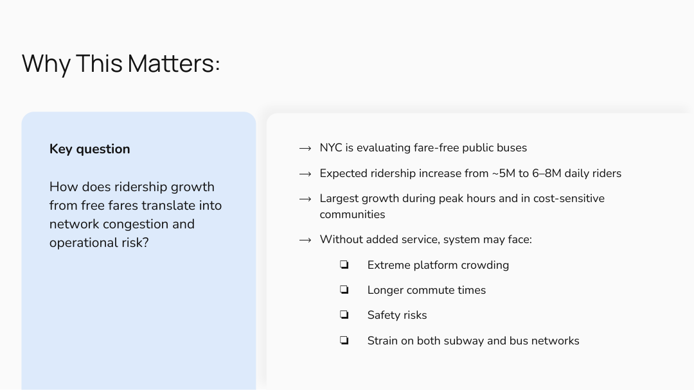
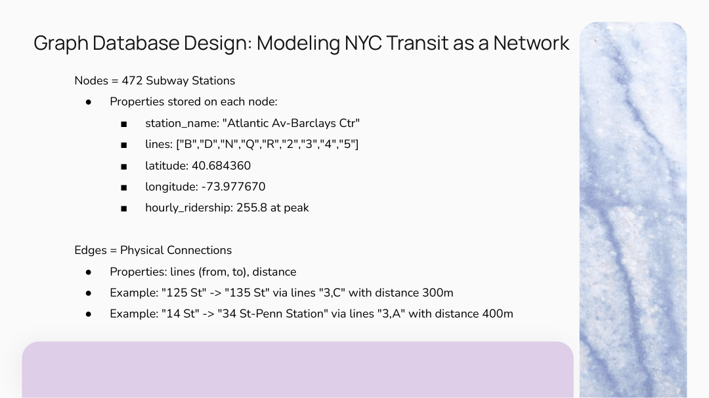
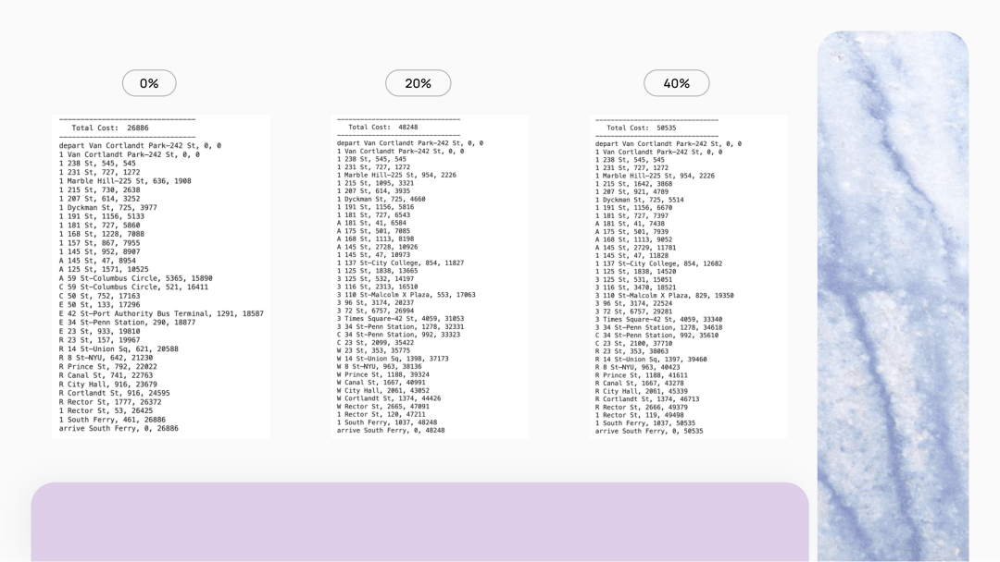
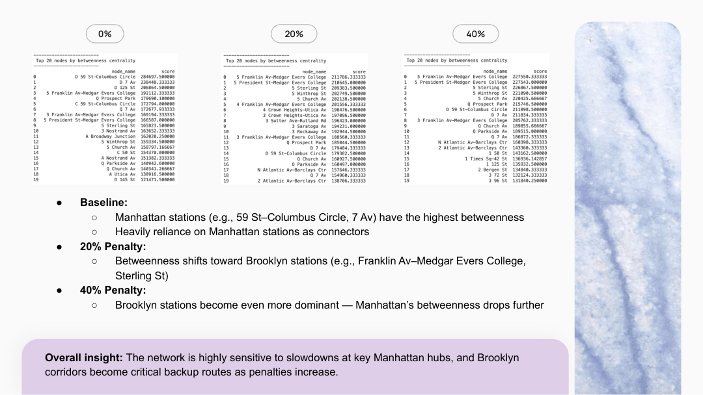
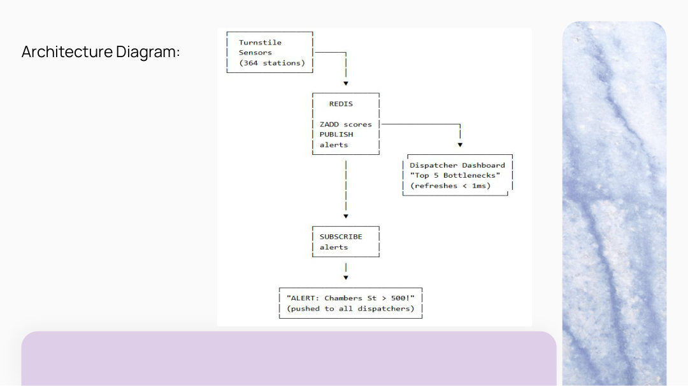

# NYC Transit Graph Analytics with Neo4j

Graph analytics case study modeling how fare-free transit ridership growth could affect NYC subway congestion, shortest paths, station bottlenecks, and network resilience.

This project represents the NYC subway system as a graph and evaluates congestion scenarios using Neo4j Graph Data Science. The analysis focuses on shortest path behavior, betweenness centrality, and Louvain community detection under baseline, +20% ridership, and +40% ridership scenarios.



## Overview

Fare-free transit can increase accessibility and ridership, but higher demand may create bottlenecks if station capacity and service frequency do not scale with usage. This project uses graph analytics to explore where congestion risk could emerge and which stations become more important to network flow.

The main questions were:

- How do shortest paths change when high-traffic stations become congested?
- Which stations act as critical connectors in the subway network?
- How can graph databases support transit planning, congestion monitoring, and operational decision-making?

## Data and Graph Design

The subway network was modeled as a graph:

| Graph Component | Meaning |
|---|---|
| Nodes | Subway stations |
| Edges | Connections between stations |
| Node attributes | Station name, latitude, longitude, and traffic estimate |
| Edge attributes | Connected stations, subway line, distance, and travel-cost weight |

A graph database is a natural fit for this problem because subway analysis depends on pathfinding, transfers, route traversal, centrality, and community structure.



## Methods

### Graph Construction

The project loads subway station, line, and distance data, then creates a Neo4j graph representation of the network. Station nodes are connected by weighted relationships representing subway links and transfers.

### Congestion Scenarios

The analysis compares three scenarios:

| Scenario | Interpretation |
|---|---|
| Baseline | Current ridership and travel-cost assumptions |
| +20% ridership | Moderate increase under fare-free transit adoption |
| +40% ridership | Higher adoption with stronger congestion pressure |

Stations projected to exceed capacity are treated as bottlenecked, and adjacent edge weights are penalized to approximate slower movement through congested parts of the system.

### Shortest Path Analysis

Neo4j shortest path analysis is used to compare route costs before and after congestion penalties. This helps estimate how bottlenecks could affect commute paths and travel efficiency.



### Betweenness Centrality

Betweenness centrality identifies stations that sit on many shortest paths and therefore act as important network connectors. These stations are especially relevant for resilience planning because disruptions or crowding at high-centrality stations can affect broader system flow.



### Community Detection

Louvain community detection is used to identify clusters of stations that are more tightly connected to each other than to the rest of the network. This helps reveal natural subway regions and corridors that may respond differently to increased ridership.

## System Architecture

The project also frames how multiple database systems could support a transit analytics platform:

| Technology | Role |
|---|---|
| PostgreSQL | Structured data loading and joins |
| Neo4j | Graph modeling, shortest path, centrality, and community detection |
| MongoDB | Flexible storage for station-level ridership scenarios and historical records |
| Redis | Real-time bottleneck lookup, congestion status, and alerting |



## Key Takeaways

- Subway networks are naturally represented as graphs because stations and route segments map directly to nodes and edges.
- Congestion penalties can shift shortest paths and increase route costs under higher ridership scenarios.
- Betweenness centrality highlights stations that are critical to network resilience and operational planning.
- Community detection reveals connected station clusters that can support region-level planning.
- Neo4j is useful for graph-heavy transit questions, while PostgreSQL, MongoDB, and Redis can support complementary data storage and real-time use cases.

## Limitations and Future Work

This project is a scenario analysis, not a full operational simulation of the NYC subway system.

Important limitations include:

- Ridership growth is modeled using simplified +20% and +40% scenarios.
- Bottleneck penalties approximate congestion but do not fully model train frequency, dwell time, platform crowding, incidents, or passenger behavior.
- The implemented analysis focuses primarily on Neo4j graph analytics rather than a production real-time system.
- MongoDB and Redis are discussed as architecture extensions but are not the core implemented analysis.

Future work could include:

- Integrating live ridership, train arrival, and service disruption feeds.
- Modeling time-of-day dynamics, platform capacity, train frequency, and transfer delays.
- Expanding the graph to include buses, walking transfers, commuter rail, and Citi Bike.
- Building a dashboard for bottleneck monitoring and congestion-aware routing.
- Comparing fare-free transit against alternatives such as targeted subsidies or increased service frequency.

## Repository Structure

```text
nyc-transit-graph-analytics/
├── README.md
├── Neo4j.ipynb
├── stations.csv
├── lines.csv
├── distances.csv
└── images/
    ├── problem_scenario.png
    ├── graph_database_design.png
    ├── shortest_path_scenarios.png
    ├── betweenness_centrality_results.png
    └── architecture_diagram.png
```

## Contributors

This was a collaborative UC Berkeley MIDS data engineering project with Bryce Szarzynski, Matthew Liu, Pratheek Sankeshi, and Aaron Luong.

My contributions included graph analytics implementation, Neo4j-based network modeling, congestion scenario analysis, shortest path analysis, and interpretation of database architecture use cases.
